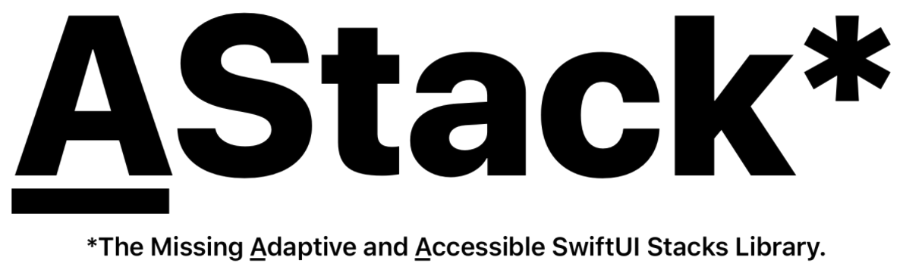
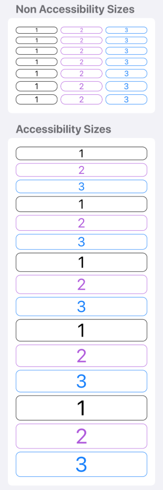
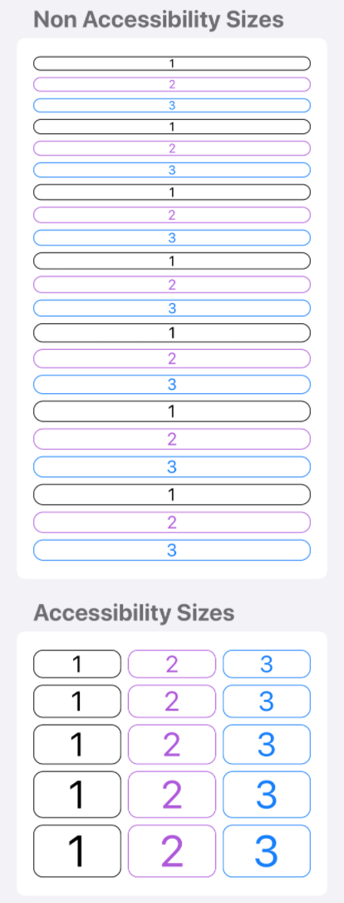

<p align="center">
    
</p>

<p align="center">
    
    <a href="https://swift.org/package-manager">
        
    </a>
     
    <a href="https://twitter.com/zntfdr">
        
    </a>
</p>

Welcome to **<ins>A</ins>Stack**, a library bringing you adaptive and accessible SwiftUI stacks.

## Introduction
 
<ins>A</ins>Stack introduces four new SwiftUI views: 

- `AHStack`
- `AVStack`
- `LazyAHStack`
- `LazyAVStack`

Their behavior is based on the [environment][environment]'s [`ContentSizeCategory`][ContentSizeCategory] and/or [`UserInterfaceSizeClass`][UserInterfaceSizeClass]:

- when the **content size** category is one that is **not** associated with accessibility, they are equivalent to SwiftUI's counterparts
- when the **content size** category is one that **is** associated with accessibility, the views switch alignment (e.g. from horizontal to vertical)
- when the associated **class size** is `.regular`, they are equivalent to SwiftUI's counterparts
- when the associated **class size** is `.compact`, the views switch alignment (e.g. from horizontal to vertical)

By default all views observe to only the `ContentSizeCategory`, however this can be changed in observing either `ContentSizeCategory` or  `UserInterfaceSizeClass`, both, or none via the `observing` `OptionSet` parameter.

## Usage

Use any <ins>A</ins>Stack view as any other stack view:

```swift
import AStack
import SwiftUI

struct ContentView: View {
  var body: some View {
    AHStack {
      ...
    }
  }
}

@available(macOS 11, iOS 14, watchOS 7, tvOS 14, *)
struct ContentView2: View {
  var body: some View {
    LazyAVStack {
      ...
    }
  }
}
```

Properties such as alignment and spacing can be customized:

```swift
import AStack
import SwiftUI

struct ContentView: View {
  var body: some View {
    AHStack(
      hAlignment: .top,    // HStack alignment
      vAlignment: .leading // VStack alignment
    ) {
      ...
    }
  }
}
```
## Examples

### AHStack



```swift
import AStack
import SwiftUI

struct ContentView: View {
  var body: some View {
    AHStack {
      ZStack {
        RoundedRectangle(cornerRadius: 12).strokeBorder()
        Text("1")
      }
      ZStack {
        RoundedRectangle(cornerRadius: 12).strokeBorder()
        Text("2")
      }.foregroundColor(.purple)
      ZStack {
        RoundedRectangle(cornerRadius: 12).strokeBorder()
        Text("3")
      }.foregroundColor(.blue)
    }
  }
}
```

### AVStack



```swift
import AStack
import SwiftUI

struct ContentView: View {
  var body: some View {
    AVStack {
      ZStack {
        RoundedRectangle(cornerRadius: 12).strokeBorder()
        Text("1")
      }
      ZStack {
        RoundedRectangle(cornerRadius: 12).strokeBorder()
        Text("2")
      }.foregroundColor(.purple)
      ZStack {
        RoundedRectangle(cornerRadius: 12).strokeBorder()
        Text("3")
      }.foregroundColor(.blue)
    }
  }
}
```

## Installation

<ins>A</ins>Stack is distributed using the [Swift Package Manager](https://swift.org/package-manager). To install it into a project, follow [this tutorial](https://developer.apple.com/documentation/swift_packages/adding_package_dependencies_to_your_app) and use this repository URL: `https://github.com/zntfdr/AStack.git`.

## Credits

<ins>A</ins>Stack was built by [Federico Zanetello](https://twitter.com/zntfdr) as a component of [Bangkok Metro](http://yourmetro.app).

## Contributions and Support

All users are welcome and encouraged to become active participants in the project continued development — by fixing any bug that they encounter, or by improving the documentation wherever it’s found to be lacking.

If you'd like to make a change, please [open a Pull Request](https://github.com/zntfdr/AStack/pull/new), even if it just contains a draft of the changes you’re planning, or a test that reproduces an issue.

Thank you and please enjoy using **<ins>A</ins>Stack**!

[ContentSizeCategory]: https://developer.apple.com/documentation/swiftui/environmentvalues/3284540-sizecategory
[Environment]: https://developer.apple.com/documentation/swiftui/environment
[UserInterfaceSizeClass]: https://developer.apple.com/documentation/swiftui/userinterfacesizeclass